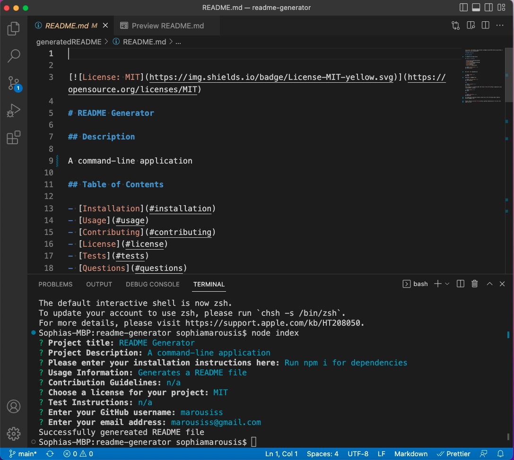
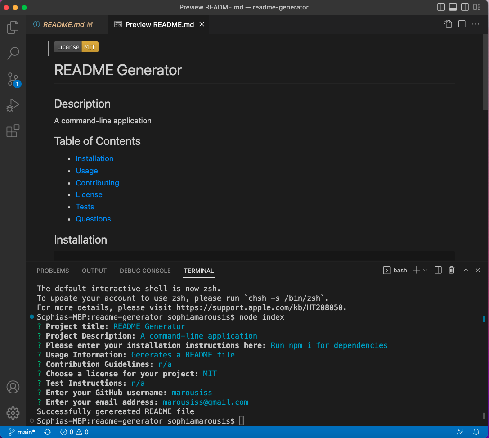

# README File Generator

## Description

This is a command-line application tha dynamically generates a README file from a users input.

Video link: https://drive.google.com/file/d/1q9T0JMizx_IGBwV_TSLf8I2up084K-1f/view?usp=sharing

## Installation

Please run `npm i` to install dependencies

## Usage

To use this application run `node index.js` in the command line.

## Credits

N/A

## License

Please refer to the LICENSE in the repo
